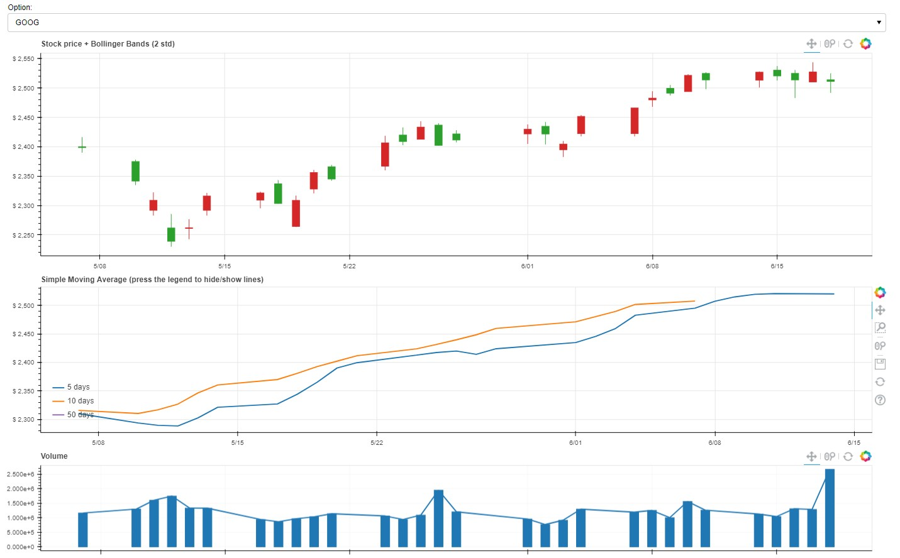

# 互動式看盤軟體

  互動式看盤軟體，簡易互動式介面讓使用者可輕鬆地分析股票，未來可結合自製的量化交易策略與人工智慧模型一同使用。

  

    
  

## 環境建置
  
    
    conda create --name stock

## 執行程式&使用方法
  
  在 pycharm 的 terminal 當中執行 `bokeh serve --show mystock.py`
  
## methods

  本作品透過，本作品使用twelvedata爬取股票資料後，使用bokeh繪製網頁。

## 輸出結果

* K線(Candlestick chart)
* 簡單移動平均線(Simple Moving Average, SMA)(5 天, 10 天, 50 天).
* 成交量(volume )

## 未來預計更新

- [ ] taiwan stock
- [ ] prdict method
- [ ] back test function
- [ ] maybe use Django and matplotlib generate static chart

## 參考文獻

  https://docs.bokeh.org/en/latest/docs/reference/models/plots.html

  https://ithelp.ithome.com.tw/articles/10196690

  https://github.com/pythonstock/stock

  https://github.com/twelvedata/twelvedata-python
