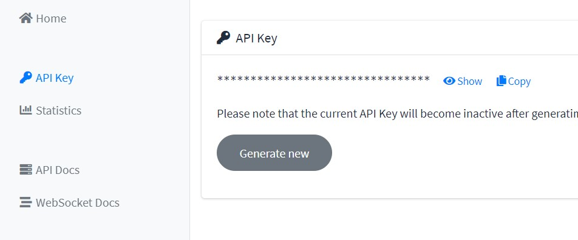

# 互動式看盤軟體

  互動式看盤軟體，簡易互動式介面讓使用者可輕鬆地分析股票，未來可結合自製的量化交易策略與人工智慧模型一同使用。
  
  一直很想做一個屬於自己的看盤軟體，並包含了，量化交易策略、人工智慧模型等工具，因此這次的project先以視覺化股票資訊為主軸。
  在視覺化的部分，我希望能做一個好看且實用的互動式前端介面，而matplotlib雖有大量的相關方法可使用，但只能輸出靜態的圖片。
  因此選用了 Bokeh 作為動態網站的繪製。
  
  

    
  

## 環境建置
  
  開啟 anaconda prompt 執行以下命令 :
    
    conda create --name stock python=3.7
    conda activate stock
    conda install git
    git clone https://github.com/chenyuting3077/my_stock.git
    cd my_stock
    pip install -r requirements.txt
    
    
## 使用方法
  
  首先，至 [Twelve Data](https://twelvedata.com) 申請帳號後取得 API KEY。
  
  

    
  

  
  接下來，更換 [mystock.py](mystock.py) 當中的 `my_api_key`
  
  最後，anaconda prompt 當中執行 `bokeh serve --show mystock.py`
  
  即可在 `http://localhost:5006/mystock` 當中查看結果
  
## 製作原理

  本作品使用twelvedata爬取股票資料後，使用bokeh繪製根據該資料繪製股票的技術指標。
  

## 技術指標

* K線(Candlestick chart)
* 簡單移動平均線(Simple Moving Average, SMA)(5 天, 10 天, 50 天)
* 成交量(volume )

## 未來預計更新

- [ ] taiwan stock
- [ ] prdict method
- [ ] back test function
- [ ] maybe use Django and matplotlib generate static chart

## 參考文獻

  https://docs.bokeh.org/en/latest/docs/reference/models/plots.html

  https://ithelp.ithome.com.tw/articles/10196690

  https://github.com/pythonstock/stock
  
  https://github.com/pedromartins4/bokeh-stock-market

  https://github.com/twelvedata/twelvedata-python
  

